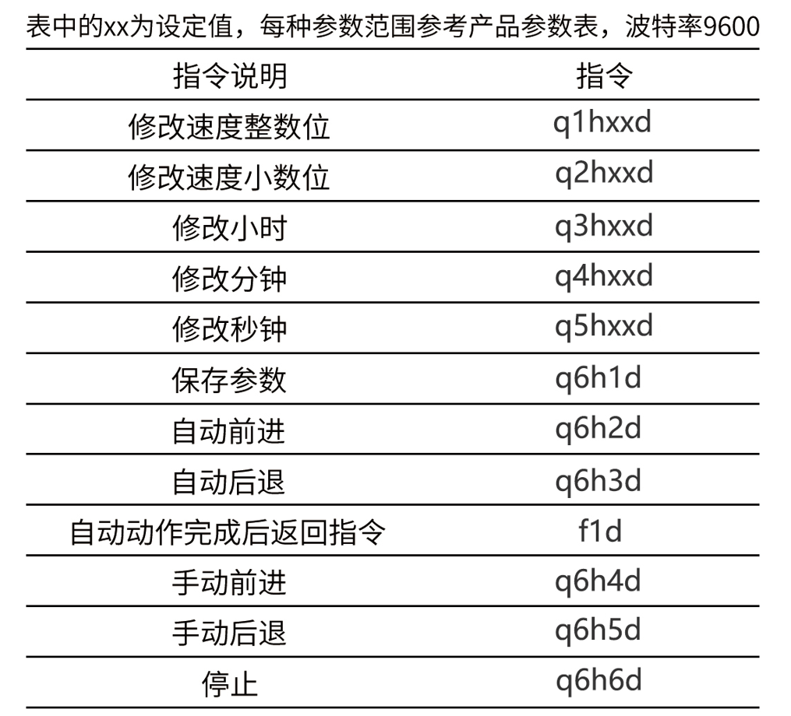

# 基于计算机视觉的AI滴定控制装置
## Mlabs AI Titration 1.0
## **[慕乐网络科技(大连)有限公司, MoolsNet](https://www.mools.net/)**


> 南京大学化学化工学院 潘孔嘉 改进版 | 2025.06

## 快速开始（Web 版）

双击 `run.bat` 即可一键启动，浏览器会自动打开 http://localhost:5000。

```
local-server/
├── run.bat                 # 一键启动脚本
├── Auto_Ctrl/              # Web 版滴定控制程序
│   ├── web_app.py          # Flask + SocketIO 服务器
│   ├── experiment.py       # 实验主逻辑（双确认终点检测）
│   ├── experiment_configs.json  # 实验配置
│   └── templates/index.html     # 前端界面
├── pths/                   # 模型权重文件（Git LFS）
├── Picture_Train/          # 模型训练代码
└── requirements_web.txt    # Web 版依赖
```

### 新增功能

- **双确认终点检测**：连续两次 AI 识别达标才判定终点，减少误判
- **置信度实时曲线**：替代电压显示，无电位仪也能观察 AI 判断趋势
- **0.5s 快速循环**：可选的快速采样模式

### 许可证

本项目采用 **GNU Affero General Public License v3.0 (AGPL-3.0)**。
- 可自由使用、修改、分发
- 修改后的代码必须同样以 AGPL-3.0 开源
- 通过网络使用本软件（含 Web 服务），必须提供源码

## 原始说明

本软件包是基于计算机视觉的AI滴定控制装置的示例程序，用于演示如何使用计算机视觉技术进行滴定控制。它包括了滴定控制程序和权重训练程序。
### 软件包内容
- **Auto_Ctrl**：滴定控制程序，包含控制滴定管的开度和注射泵两种控制方式的原始程序。
- **Picture_Train**：权重训练程序，用于训练神经网络模型。
- **MAT_1.2.2_exe可执行文件**：exe版本有界面ui的程序（网盘链接和说明）。

### 常见问题请参见：[常见问题汇总](https://docs.qq.com/doc/DWmxGckJNdU1yTWhC)

### 使用前的准备

- 计算机硬件：一台计算机，至少需要安装Windows操作系统。
- 软件依赖：本软件包需要安装Python、PyCharm，建议安装Anaconda、CUDA、cuDNN等软件。
- 软件依赖：使用前请先安装ch340驱动，否则无法识别COM串口。
- 软件依赖：使用前请按照requirements.txt文件安装依赖项。
- 硬件测试：使用前请先使用电机控制板的按键测试电机是否正常。
- 硬件准备：注射泵版本使用前请先将注射泵活塞手动(按键)移动到注射器体积归零位置。
- 硬件准备：蠕动泵版本使用前请先将蠕动泵活塞手动(按键)控制到液体充满管子。
- 硬件准备：基础(滴定管)版本使用前请先调节好滴定管活塞初始位置和开启时的角度速度。

### 本软件推荐使用的软件及其版本为：

### [Python3.10.11(64-bit)](https://www.python.org/ftp/python/3.10.11/python-3.10.11-amd64.exe)   
[Python3.10.11(32-bit)](https://www.python.org/ftp/python/3.10.11/python-3.10.11.exe)  
[Python 安装教程（新手）-CSDN博客](https://blog.csdn.net/qq_45502336/article/details/109531599)

### [PyCharm](https://www.jetbrains.com/pycharm/download/?section=windows#section=windows)  
注意请下载社区板（PyCharm Community Edition），不要下载专业版（PyCharm Professional Edition），专业版需要付费。
[PyCharm 安装教程-CSDN博客](https://blog.csdn.net/qq_44809707/article/details/122501118)

### [Anaconda](https://repo.anaconda.com/archive/Anaconda3-2024.06-1-Windows-x86_64.exe)  
[最新 Anaconda3 的安装配置及使用教程-CSDN博客](https://blog.csdn.net/qq_43674360/article/details/123396415)  
[在 PyCharm 中配置使用 Anaconda 环境-CSDN博客](https://blog.csdn.net/TuckX/article/details/115681862)

### [CUDA](https://developer.nvidia.com/cuda-toolkit-archive)  
[cuDNN](https://developer.nvidia.com/cudnn-downloads)  
[CUDA安装教程](https://blog.csdn.net/m0_45447650/article/details/123704930)  
[如何使用CUDA编译Torch](htts://blog.csdn.net/qq_46941656/article/details/119701547)

注：我们写了一个简单的安装流程文档 **简易版_CUDA_cuDNN_和_PyTorch-GPU_安装流程.pdf** ，放在了本软件包的根目录下，有需要的可以下载使用

这个软件包提供的是基础程序，理论上大家直接执行也可以完成整个滴定控制过程，但是我们还是希望大家可以发挥自己的创造力和奇思妙想，选用不同的控制方式、神经网络等

### 基于计算机视觉的AI滴定控制装置(AI_Titration)
软件包中的示例程序分别放置在3个文件夹中，此外附带了3个说明文件和1份附录文件夹，之所以这样做是比较符合一般常见的Python软件包的模式。

### Auto_Ctrl 
**Auto_Ctrl** 文件夹里面包含的是 **滴定控制程序** 和依赖项。本软件包中使用的是COM串口接电机控制板，包含电机控制滴定管开度的“致敬经典”方案、注射泵方案和蠕动泵方案。详情参见此文件夹中的`README.md`文件。

### Picture_Train
**Picture_Train** 文件夹里面包含的是 **权重训练程序** 、训练集、测试集以及依赖项。本软件包中使用的是Resnet34网络的训练程序。详情参见此文件夹中的`README.md`文件。

### pths
**pths** 文件夹包含了现有的神经网络模型训练后得到的权重文件，后续新增的权重文件也会逐步更新，文件名将尽量以实验内容+Net命名

### LICENSE
**LICENSE** 此文件包含了项目的许可协议。这告诉用户和其他开发者他们如何使用、修改和分发代码。Python包通常使用开源许可协议，如MIT、BSD、Apache 2.0或GPL等。在 LICENSE 文件中，包含完整的许可协议文本，确保用户明确了解他们使用代码的权利和义务。

### README.md
**README.md** 此文件是项目的文档说明，它向用户提供了关于项目的详细信息。README 文件通常以Markdown格式编写（文件扩展名为 .md），这样它可以在GitHub等平台上以易于阅读的格式呈现。在PyPI上发布包时，README 文件的内容也可以作为项目的长描述显示。

### requirements.txt
**requirements.txt** 文件在Python项目中扮演着非常重要的角色。它主要用于列出项目运行所需的所有外部Python包及其版本号。这个文件的主要目的是确保项目的依赖环境可以在不同的环境中被一致地重现，无论是开发环境、测试环境还是生产环境。

当你使用pip（Python的包管理工具）时，可以通过requirements.txt文件来安装项目所需的所有依赖包。具体方法参见：[常见问题汇总](https://docs.qq.com/doc/DWmxGckJNdU1yTWhC)

### 简易版_CUDA_cuDNN_和_PyTorch-GPU_安装流程.pdf
**简易版_CUDA_cuDNN_和_PyTorch-GPU_安装流程.pdf** 是一份详细的安装流程文档，详细介绍了如何在Windows系统上安装CUDA、cuDNN和PyTorch-GPU。这份文档旨在帮助用户快速、轻松地完成CUDA、cuDNN和PyTorch-GPU的安装，以便在GPU上运行深度学习模型。

最后介绍一下软件包里附带的两个驱动

### ch340驱动官网下载
**ch340驱动官网下载** 文件夹里放的exe文件是USB转TTL串口工具的驱动，安装完成后重启电脑，即可在设备管理器里面查看该通讯模块的串口号

### sscom32
**sscom32** 文件夹里面是串口调试工具

视频教程可以参考assets文件夹内的两个视频

串口指令如下



### 更多问题请参见：[常见问题汇总](https://docs.qq.com/doc/DWmxGckJNdU1yTWhC)
